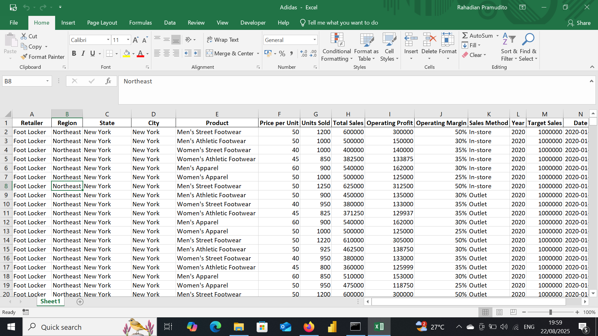

# Adidas Retail Sales Analysis

## Project Overview

**Project Title**: Retail Sales Analysis  
**Database**: `Adidass`

This project aims to analyze Adidas sales data using an end-to-end approach: starting with data exploration and cleaning in Python, followed by interactive visualization in Power BI. The final output is a dashboard that supports data-driven business decision-making.

## Objectives

1. **Import retail sales database**: Import Adidas Retail Sales database.
2. **Data Cleaning**: Identify and remove any records with missing or null values.
3. **Standardizing Data**: Identify and standardize any records to give a better visualization.
4. **Exploratory Data Analysis (EDA)**: Perform basic exploratory data analysis to understand the dataset.
5. **Business Analysis**: Use Power BI to answer specific business questions and derive insights from the sales data.

## Project Structure

### 1. Database Setup

- **Database Creation**: The project starts by import a database from `Adidas.csv`.

  


### 2. Data Cleaning

- **Remove Duplicate**: Remove any duplicate record.
- **Standardize Data**: Ensure the data ready for analysis.
- **Null Value Check**: Check for any null values in the dataset and delete records with missing data.
- **Remove Columns**: Remove column that unused such as row_num. 

```jupyterlab

import pandas as pd

df = pd.read_excel(r"C:\Users\user\OneDrive\Documents\Dataset\New Portfolio\Adidas Sales\adidas_sales.xlsx")
df

df = df.drop(columns = ["Unnamed: 0", "Retailer ID"])

df = df.drop(columns = ['Invoice Date', 'Time'])
```

### 3. Standardizing Data

```jupyter lab
df = df.astype({
    'Price per Unit': 'int',
    'Units Sold': 'int',
    'Total Sales': 'int',
    'Operating Profit': 'int',
})

df['Date'] = df['Invoice Date'].dt.date
df['Time'] = df['Invoice Date'].dt.time
```
### 4. Exploratory Data Analysis
```jupyter lab
df.shape

df.info()

df.describe()
```

### 5. Export to excel for Power BI Visualization
```jupyter lab
df.to_excel("Adidas.xlsx", index=False)
```

### 6. Data Analysis & Findings


  

## Findings

- Payment Methods: Cash on Delivery leads in sales, followed by Wallet and Card. UPI lags behind.
- Top Products by Gender: Sneakers and Hoodies dominate in the male and unisex segments. Female customers tend to prefer Hoodies.
- Best-Selling Categories: Streetwear and Limited Edition account for 56% of total sales.
- Monthly Sales Trends (2020 - 2021): Sales consistently increased from January to November, indicating a seasonal pattern.
- Brand Performance: Nike and Adidas show consistent performance. Off-White excels in the male segment, while Puma and Supreme are more favored by female customers.


My social media:

- **Instagram**: [Let's Connect](https://www.instagram.com/inirtp?igsh=MW9xZTU0bTRuaHlxeQ==)
- **LinkedIn**: [Connect with me professionally](https://www.linkedin.com/in/rahadian-triaji-pramudito-a43949273/)

I look forward to connecting with you!
