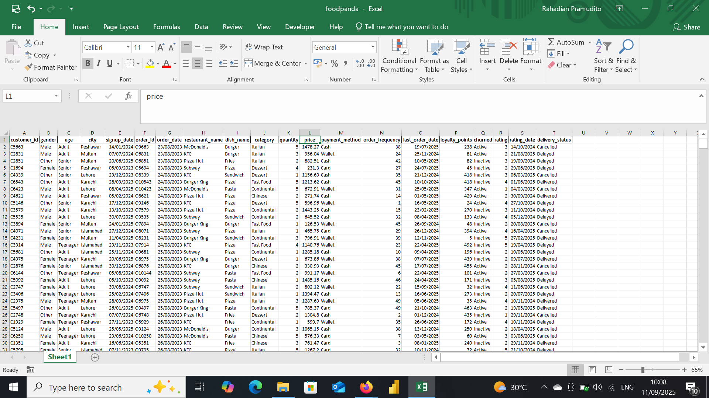
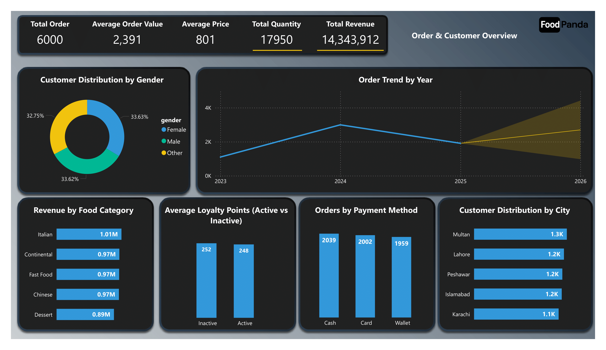
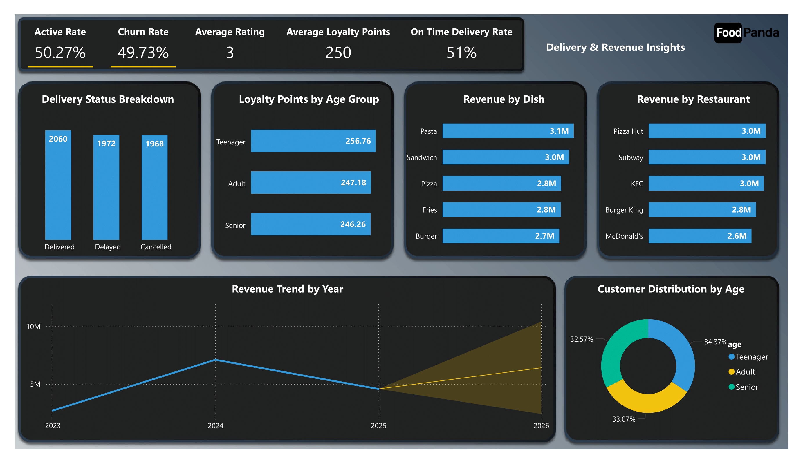

# Foodpanda Analytics Dashboard

## Project Overview

**Project Title**: Foodpanda Delivery Analysis  
**Database**: `foodpanda`

This project is designed to demonstrate analysis Python, Power BI and techniques typically used by data analysts to explore, clean, and analyze superstore sales data. The project involves import database from csv file and performing exploratory data analysis (EDA).

## Objectives

1. **Import database**: Import Foodpanda database from csv.
2. **Data Cleaning**: Identify and remove any records with missing or null values.
3. **Standardizing Data**: Identify and standardize any records to give a better visualization.
4. **Exploratory Data Analysis (EDA)**: Perform basic exploratory data analysis to understand the dataset.
5. **Business Analysis**: Use Power BI derive insights from the delivery data.

## Project Structure

### 1. Database Setup

- **Database Creation**: The project starts by import a database from `foodpanda.xlsx`.

  


### 2. Data Cleaning

- **Import database**: Import database to do a data transformations, cleaning etc.
- **Remove Duplicate**: Remove any duplicate record.
- **Standardize Data**: Ensure the data ready for analysis.
- **Explore Data** : To understand how the data is. 
 

```jupyterlab

import pandas as pd

df = pd.read_csv(r"C:\Users\user\OneDrive\Documents\Dataset\New Portfolio\Foodpanda\Foodpanda.csv")
df
```

### 3. Standardizing Data

```jupyter lab
df['signup_date'] = pd.to_datetime(df['signup_date'], format='mixed')

df['order_date'] = pd.to_datetime(df['order_date'], format='mixed')

df['last_order_date'] = pd.to_datetime(df['last_order_date'], format='mixed')

df['rating_date'] = pd.to_datetime(df['rating_date'], format='mixed')
```

### 4. Exploratory Data Analysis
```jupyter lab
df.info()

df.describe

df.duplicated().sum()

df.head()

df['age'].value_counts()

df['city'].value_counts()

df['delivery_status'].value_counts()

import seaborn as sns
sns.countplot(data=df, x='delivery_status')

sns.barplot(data=df, x='churned', y='loyalty_points', estimator='mean')

sns.scatterplot(data=df, x='age', y='loyalty_points')

df.to_excel('foodpanda.xlsx', index=False)
```

### 6. Data Analysis & Findings

## Order & Customer Overview

  

## Findings

1. Order Trend by Year
Orders increased in 2024 but dropped again in 2025 → possibly due to seasonality or stronger competition.

2. Customer Distribution by Gender
Customer distribution is relatively balanced across Male, Female, and Other (around 33% each). → Marketing strategies can be designed to be gender-neutral.

3. Revenue by Food Category
Italian & Continental dominate revenue (≈1M). Dessert generates the lowest revenue.

4. Orders by Payment Method
Cash is still the most used payment method (2,039), compared to Card (2,002) and Wallet (1,959).

5. Customer Distribution by City
Multan has the highest orders (1.3K), while Karachi has the lowest (1.1K).

6. Loyalty Points (Active vs Inactive)
The number of active and inactive customers is almost the same → potential churn risk if engagement is not improved.

## Strategic Recomendations
- Focus promotions in cities with lower orders (Karachi, Islamabad) to balance customer distribution.
  
- Encourage digital payment adoption through special promotions for Wallet/Card users.
  
- Boost dessert sales with menu bundling (e.g., “Buy 1 main dish, get 50% off dessert”).
  
- Strengthen the loyalty program to re-engage inactive customers and reduce churn.


## Revenue & Churn Analysis



## Findings

1. Delivery Status
Delivered: 2,060, Delayed: 1,972, Cancelled: 1,968 → high delay and cancellation rates.

2. Loyalty Points by Age
Teenagers hold higher loyalty points compared to Adults & Seniors → younger segment is more engaged.

3. Total Revenue by Dish & Restaurant
Pasta (3.1M) & Pizza Hut (3.0M) are top performers. McDonald’s & Burger generate lower revenue.

4. Total Revenue by Year
Revenue increased in 2024, dropped in 2025, but the forecast for 2026 shows sharp growth.

5. Customer Distribution by Age
Adults (34.37%) are slightly more dominant compared to Teenagers & Seniors (~33% each).

## Strategic Reccomendations

- Improve delivery processes → high delays & cancellations could reduce customer satisfaction.
  
- Target marketing towards Adults (34%) while keeping Teenagers engaged due to their higher loyalty points.

- Optimize best-selling menu items (Pasta & Pizza Hut) → can be used as a signature campaign.
  
- Revitalize underperforming items (McDonald’s, Burger) with special promotions.
  
- Closely monitor 2026 revenue forecast → ensure key drivers (promotion, operations, supply chain) are sustained.

My social media:

- **Instagram**: [Let's Connect](https://www.instagram.com/inirtp?igsh=MW9xZTU0bTRuaHlxeQ==)
- **LinkedIn**: [Connect with me professionally](https://www.linkedin.com/in/rahadian-triaji-pramudito-a43949273/)

I look forward to connecting with you!
