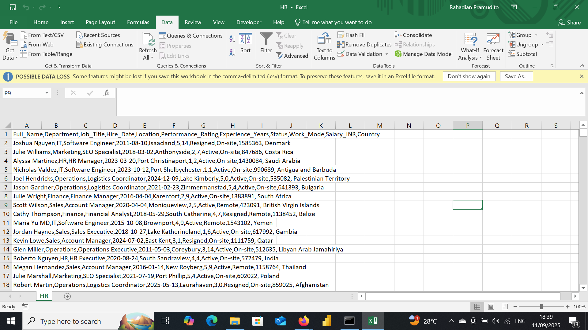
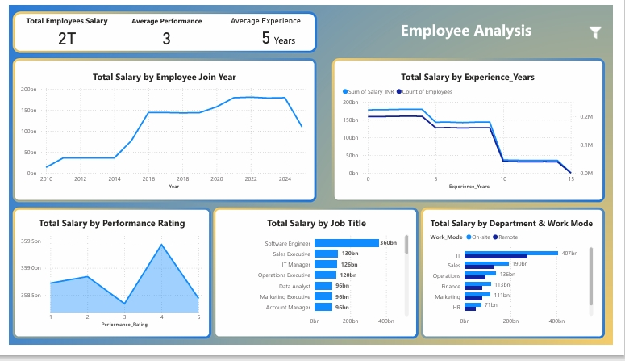

# HR MultiCompany 

## Project Overview

**Project Title**: HR MultiCompany Analysis  
**Database**: `HR`

This project is designed to demonstrate analysis Python, Power BI and techniques typically used by data analysts to explore, clean, and analyze superstore sales data. The project involves import database from csv file and performing exploratory data analysis (EDA).

## Objectives

1. **Import database**: Import HR database from csv.
2. **Data Cleaning**: Identify and remove any records with missing or null values.
3. **Standardizing Data**: Identify and standardize any records to give a better visualization.
4. **Exploratory Data Analysis (EDA)**: Perform basic exploratory data analysis to understand the dataset.
5. **HR Analysis**: Use Power BI to answer specific HR questions and derive insights from the employee data.

## Project Structure

### 1. Database Setup

- **Database Creation**: The project starts by import a database from `HR.csv`.
- 
| Dataset | Size | Link |
|---------|------|------|
| Dataset | 399 MB | [Download](https://drive.google.com/drive/u/0/folders/10ZV9ySWatL_s5oT-V2YUG-CDHTZp6seB) |

  


### 2. Data Cleaning

- **Import database**: Import database to do a data transformations, cleaning etc..
- **Remove Duplicate**: Remove any duplicate record.
- **Standardize Data**: Ensure the data ready for analysis.
- **Null Value Check**: Check for any null values in the dataset and delete records with missing data.
- **Remove Columns**: Remove column that unused. 

```jupyterlab

import pandas as pd
import seaborn as sns
import numpy as np
import matplotlib.pyplot as plt

df = pd.read_csv(r"C:\Users\user\OneDrive\Documents\Dataset\New Portfolio\HR Data\HR_Data.csv")
df
```

### 3. Standardizing Data

```jupyter lab
df[['Location','Country']] = df['Location'].str.split(',', expand=True)
```

### 4. Exploratory Data Analysis
```jupyter lab
df.info()

df.describe()

df.head()

df.isnull().sum()

df.shape

df.duplicated().sum()


sns.barplot(data=df, x='Department', y='Salary_INR', estimator=np.mean)

df.to_csv('HR.csv', index=False)
```

### 5. Remove Columns
```jupyter lab
df.drop(columns=['Unnamed: 0', 'Employee_ID'], inplace=True)
```

### 6. Data Analysis & Findings

| Dataset | Size | Link |
|---------|------|------|
| PBIX File | 39 MB | [Download](https://drive.google.com/drive/u/0/folders/10ZV9ySWatL_s5oT-V2YUG-CDHTZp6seB) |


  

## Findings

1. High-level KPI
- Total Employee Salary: 2T → very large payroll budget.
- Average Performance: 3 (scale 1–5) → workforce has average performance, room for improvement.
- Average Experience: 5 years → employees are mostly mid-level, not too junior.

2. Salary by Employee Join Year
- Strong salary growth between 2014–2022, with a peak in 2020–2022.
- After 2023, total salary declined → possibly due to attrition or reduced hiring.

3. Salary by Experience (Years)
- Salary remains stable for employees with 0–5 years of experience.
- Sharp drop after 10 years of experience → indicates fewer senior employees in the company.

4. Salary by Performance Rating
- Employees with rating 4 take the highest share of salary → most high-performing employees are in this group.
- Surprisingly, rating 5 salaries are lower than rating 4 → suggests fewer employees achieve top ratings.

5. Salary by Job Title
- Software Engineers account for the largest payroll share (360B).
- Followed by Sales Executives, IT Managers, and Operations Executives.
- Functions like HR and Marketing contribute relatively less.

6. Salary by Department & Work Mode
- IT Department dominates payroll (407B).
- Followed by Sales (190B) and Operations (128B).
- HR & Marketing remain small.
- Majority of employees are on-site, while remote work is still limited.

## Overall Insights

 1. Workforce composition: heavily IT-driven, especially Software Engineers.
 2. Experience distribution: mostly mid-level, very few senior employees.
 3. Performance impact: rating 4 employees dominate payroll, rating 5 is rare.
 4. Salary trend: rising until 2022, then dropping, likely due to turnover or reduced recruitment.
 5. Work mode: company still prioritizes on-site work over remote.


My social media:

- **Instagram**: [Let's Connect](https://www.instagram.com/inirtp?igsh=MW9xZTU0bTRuaHlxeQ==)
- **LinkedIn**: [Connect with me professionally](https://www.linkedin.com/in/rahadian-triaji-pramudito-a43949273/)

I look forward to connecting with you!
