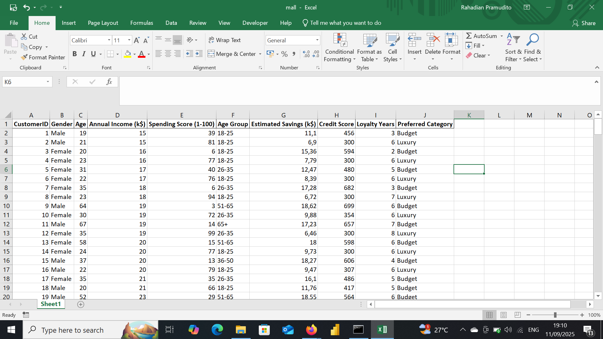
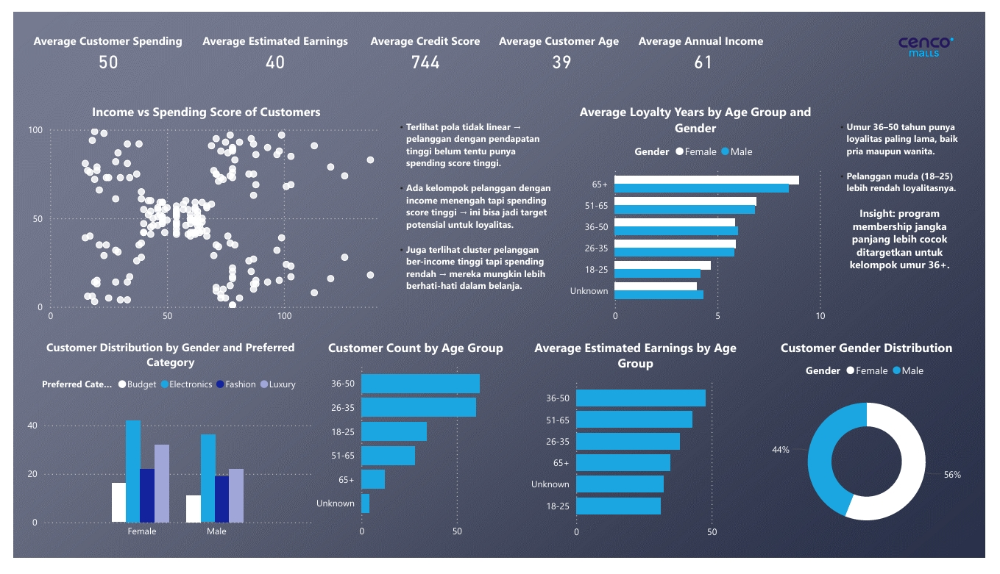

# Mall Customer

## Project Overview

**Project Title**: Mall Customer Analysis  
**Database**: `Mall`

This project is designed to demonstrate analysis Python, Power BI and techniques typically used by data analysts to explore, clean, and analyze superstore sales data. The project involves import database from csv file and performing exploratory data analysis (EDA).

## Objectives

1. **Import database**: Import Mall Customer database from csv.
2. **Data Cleaning**: Identify and remove any records with missing or null values.
3. **Standardizing Data**: Identify and standardize any records to give a better visualization.
4. **Exploratory Data Analysis (EDA)**: Perform basic exploratory data analysis to understand the dataset.
5. **Business Analysis**: Use Power BI to answer specific business questions and derive insights from the sales data.

## Project Structure

### 1. Database Setup

- **Database Creation**: The project starts by import a database from `sushi_restaurant.csv`.

  


### 2. Data Cleaning

- **Import database**: Import database to do a data transformations, cleaning etc..
- **Remove Duplicate**: Remove any duplicate record.
- **Standardize Data**: Ensure the data ready for analysis.
- **Null Value Check**: Check for any null values in the dataset and delete records with missing data.
- **Remove Columns**: Remove column that unused. 

```jupyterlab

import pandas as pd

df = pd.read_csv(r"C:\Users\user\OneDrive\Documents\Dataset\New Portfolio\Mall Customer\Mall.csv")
df
```

### 3. Standardizing Data

```jupyter lab
df['Age Group'] = df['Age Group'].fillna('Unknown')
```

### 4. Exploratory Data Analysis
```jupyter lab
df.info()

df.describe

df.head()

df.isnull().sum()

df.duplicated().sum()

df['Preferred Category'].value_counts()

import matplotlib.pyplot as plt

avg_loyalty = df.groupby('Age Group')['Loyalty Years'].mean().reset_index()

plt.bar(avg_loyalty['Age Group'], avg_loyalty['Loyalty Years'])
plt.show()

df.to_excel('mall.xlsx', index=False)
```

### 6. Data Analysis & Findings


  

## Findings

🔹 Income vs Spending Score

- No linear pattern → high income does not always mean a high spending score.
- There is a cluster of middle-income customers with high spending scores → potential targets for loyalty programs.
- Customers with high income but low spending → likely to be more cautious with purchases.

🔹 Loyalty by Age Group & Gender

- Customers aged 36–50 have the longest loyalty (both male and female).
- Younger customers (18–25) → show lower loyalty.
- Insight: Long-term membership programs are best targeted at customers aged 36+.

🔹 Customer Distribution by Gender & Preferred Category

- Female: dominant in Electronics and Fashion.
- Male: dominant in Electronics and Budget.
- Luxury category is relatively balanced.

🔹 Customer Count by Age Group

- The majority of customers are in the 36–50 age group, followed by 26–35.
- The 65+ segment is the smallest → senior customers rarely shop.

🔹 Estimated Earnings by Age Group

- Customers aged 36–50 and 51–65 have the highest earnings.
- Young customers (18–25) have the lowest earnings.

🔹 Customer Gender Distribution

- 56% Female vs 44% Male → female customers slightly outnumber male customers.

## Executive Summary

The analysis highlights that customers aged 36–50 are the most valuable segment, with the highest loyalty, strong earnings, and the largest customer base. Women represent 56% of customers, with strong preferences for Electronics and Fashion, while men lean toward Electronics and Budget categories. Younger customers (18–25) show lower loyalty and earnings, requiring different engagement strategies. Additionally, mid-income customers with high spending potential should be prioritized for premium loyalty programs.


## Strategic Recomendations

1. Focus on the 36–50 age group
    - They represent the largest customer base with high loyalty and strong earnings.
    - Prioritize long-term membership and exclusive offers for this segment.

2. Engage younger customers (18–25)
    - Introduce gamified loyalty programs, discounts, or student packages.
    - Build habits early to increase retention over time.

3. Leverage female customer dominance (56%)
    - Strengthen product bundles in Electronics and Fashion.
    - Create targeted campaigns highlighting trends and lifestyle benefits.

4. Optimize for high-spending middle-income customers
    - Offer premium loyalty tiers or cashback programs to retain this cluster.
    - Use personalized marketing to encourage repeat purchases.

5. Tailor male customer strategies
    - Focus on Electronics and Budget categories with value-driven offers.
    - Position bundles and tech-oriented promotions for this segment.

6. Develop senior-friendly programs (65+)
    - Special discounts or simplified shopping experiences to attract older customers.
    - Collaborate with healthcare or lifestyle partners to increase relevance.

My social media:

- **Instagram**: [Let's Connect](https://www.instagram.com/inirtp?igsh=MW9xZTU0bTRuaHlxeQ==)
- **LinkedIn**: [Connect with me professionally](https://www.linkedin.com/in/rahadian-triaji-pramudito-a43949273/)

I look forward to connecting with you!
