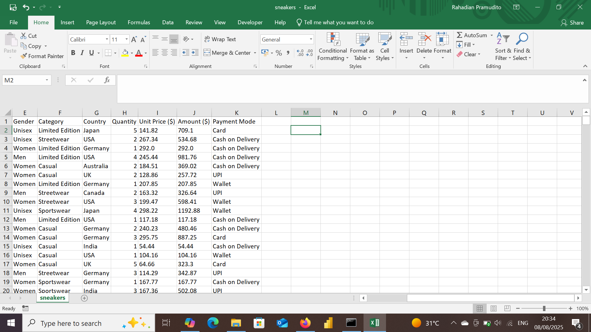

# John Doe's Retail Sales

## Project Overview

**Project Title**: Retail Sales Analysis  
**Database**: `sneakers`

This project is designed to demonstrate analysis Python, Power BI and techniques typically used by data analysts to explore, clean, and analyze retail sales data. The project involves import database from csv file, performing exploratory data analysis (EDA), and answering specific business questions through SQL queries.

## Objectives

1. **Import retail sales database**: Import retail sales database from csv.
2. **Data Cleaning**: Identify and remove any records with missing or null values.
3. **Standardizing Data**: Identify and standardize any records to give a better visualization.
4. **Exploratory Data Analysis (EDA)**: Perform basic exploratory data analysis to understand the dataset.
5. **Business Analysis**: Use Power BI to answer specific business questions and derive insights from the sales data.

## Project Structure

### 1. Database Setup

- **Database Creation**: The project starts by import a database from `sneakers.csv`.

  


### 2. Data Cleaning

- **Create a new database**: Create a new database to do a data transformations, cleaning etc to make sure if any misquery, i don't lose the data.
- **Remove Duplicate**: Remove any duplicate record.
- **Standardize Data**: Ensure the data ready for analysis.
- **Null Value Check**: Check for any null values in the dataset and delete records with missing data.
- **Remove Columns**: Remove column that unused such as row_num. 

```jupyterlab

import pandas as pd

df = pd.read_csv(r"C:\Users\user\OneDrive\Documents\Dataset\New Portfolio\Sneakers Sales\sneakers.csv")
df
```

### 3. Standardizing Data

```jupyter lab
df['Date'] = pd.to_datetime(df['Date'], format='%Y/%m/%d').dt.normalize()

# Hitung Q1, Q3, dan IQR
Q1 = df[['Quantity', 'Unit Price ($)', 'Amount ($)']].quantile(0.25)
Q3 = df[['Quantity', 'Unit Price ($)', 'Amount ($)']].quantile(0.75)
IQR = Q3 - Q1

# Filter baris yang mengandung outlier
outliers = df[
    ((df[['Quantity', 'Unit Price ($)', 'Amount ($)']] < (Q1 - 1.5 * IQR)) |
     (df[['Quantity', 'Unit Price ($)', 'Amount ($)']] > (Q3 + 1.5 * IQR))).any(axis=1)
]

# Cetak hasil outlier
print("Jumlah outlier terdeteksi:", len(outliers))
print(outliers[['Date', 'Product Name', 'Quantity', 'Unit Price ($)', 'Amount ($)']])


import seaborn as sns
import matplotlib.pyplot as plt


# Boxplot untuk Quantity
sns.boxplot(x=df['Quantity'])
plt.title('Boxplot Quantity')
plt.show()

# Boxplot untuk Unit Price
sns.boxplot(x=df['Unit Price ($)'])
plt.title('Boxplot Unit Price')
plt.show()
```
### 4. Exploratory Data Analysis
```jupyter lab
df.info()

df.describe

df.dtypes

df.isnull().sum()

df.duplicated().sum()

df.to_excel('sneakers.excel', index=False)
```

### 5. Data Analysis & Findings


  

## Findings

1. Preferred Payment Methods
- Cash on Delivery leads with $4.0M in sales, followed by Wallet and Card (each at $3.6M).
- UPI lags behind at $2.6M, suggesting customers favor traditional and wallet-based payments over direct bank transfers.

2. Top Products by Gender
- Sneakers and Hoodies dominate across male and unisex segments.
- Female customers prefer Hoodies ($1.2M) and Sneakers ($1M), but overall purchase volumes are lower than male counterparts.
- Items like Joggers, Caps, and T-shirts contribute less to total sales.

3. Best-Selling Categories
- Streetwear and Limited Edition are the top performers (each at 28% of total sales).
- Casual and Sportswear trail behind at 22%, indicating a stronger consumer interest in edgy and exclusive fashion.

4. 2022 Monthly Sales Trends
- Sales steadily rise from January ($1.5M) to a peak in November ($2.8M).
- Clear seasonal pattern suggests opportunities for targeted promotions—especially toward year-end.

5. Brand Performance by Gender
- Nike and Adidas perform well across all gender segments.
- Off-White excels with male customers (42.24%) but underperforms in unisex.
- Puma, Supreme, and New Era show stronger traction among female shoppers.
- Essentials dominates male sales (45.33%) but has limited appeal among women.


My social media:

- **Instagram**: [Let's Connect](https://www.instagram.com/inirtp?igsh=MW9xZTU0bTRuaHlxeQ==)
- **LinkedIn**: [Connect with me professionally](https://www.linkedin.com/in/rahadian-triaji-pramudito-a43949273/)

I look forward to connecting with you!
