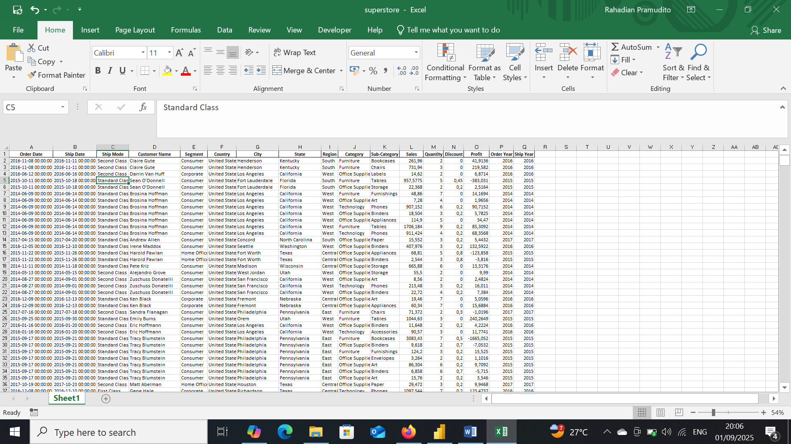
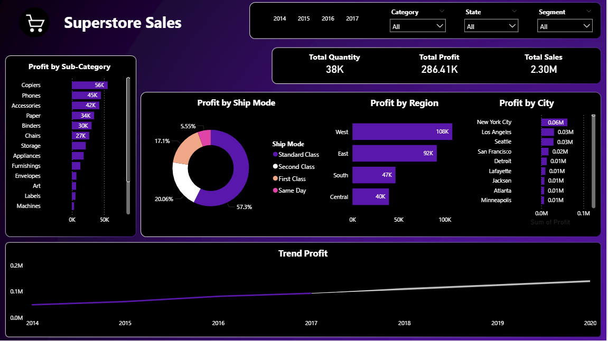

# Superstore Sales

## Project Overview

**Project Title**: Superstore Sales Analysis  
**Database**: `superstore`

This project is designed to demonstrate analysis Python, Power BI and techniques typically used by data analysts to explore, clean, and analyze superstore sales data. The project involves import database from csv file and performing exploratory data analysis (EDA).

## Objectives

1. **Import retail sales database**: Import superstore sales database from csv.
2. **Data Cleaning**: Identify and remove any records with missing or null values.
3. **Standardizing Data**: Identify and standardize any records to give a better visualization.
4. **Exploratory Data Analysis (EDA)**: Perform basic exploratory data analysis to understand the dataset.
5. **Business Analysis**: Use Power BI to answer specific business questions and derive insights from the sales data.

## Project Structure

### 1. Database Setup

- **Database Creation**: The project starts by import a database from `superstore.csv`.

  


### 2. Data Cleaning

- **Import database**: Import database to do a data transformations, cleaning etc..
- **Remove Duplicate**: Remove any duplicate record.
- **Standardize Data**: Ensure the data ready for analysis.
- **Null Value Check**: Check for any null values in the dataset and delete records with missing data.
- **Remove Columns**: Remove column that unused. 

```jupyterlab

import pandas as pd
import seaborn as sns
import matplotlib.pyplot as plt

df = pd.read_csv(r"C:\Users\user\OneDrive\Documents\Dataset\New Portfolio\Superstore\superstore.csv", encoding='latin1')
df
```

### 3. Standardizing Data

```jupyter lab
df['Ship Date'] = pd.to_datetime(df['Ship Date'])

df['Order Date'] = pd.to_datetime(df['Order Date'])

df['Order Year'] = df['Order Date'].dt.year
df['Ship Year'] = df['Ship Date'].dt.year

df.isnull().sum()

df.duplicated().sum()

profit_per_year = df.groupby('Order Year')['Profit'].sum().reset_index()
sns.lineplot(data=profit_per_year, x='Order Year', y='Profit')
```
### 4. Exploratory Data Analysis
```jupyter lab
df.info()

df.describe

df.head()

df.isnull().sum()

df.duplicated().sum()

df.to_excel('superstore.xlsx', index=False)
```

### 5. Remove Columns
```jupyter lab
df.drop(columns = ['Row ID', 'Order ID', 'Customer ID', 'Product ID', 'Postal Code'], inplace=True)
```

### 6. Data Analysis & Findings


  

## Findings

1. Profit by Shipping Method
- Standard Class appears to be the most dominant shipping method in terms of both volume and profit.
- Same Day and First Class may incur higher costs, but it's worth analyzing whether their profit margins justify the operational expenses.
  
2. Profit by Region
- The West and East regions show high profitability, indicating strong market potential.
- The South region is relatively lower, possibly due to purchasing power or suboptimal distribution strategies.
  
3. Profit by City
- Cities like New York, Los Angeles, and Seattle lead in profit, suggesting sales concentration in metropolitan areas.
- Cities with lower profit could be targeted for specialized marketing or promotional strategies.
  
4. Profit Trend (2014–2017)
- Profit shows a consistently upward trend, indicating healthy business growth.
- Any spikes or dips in specific years should be further analyzed to understand external factors (e.g., promotions, price changes, seasonality).
  
5. Product Categories
- Although not directly shown in the charts, the category filters (Furniture, Office Supplies, Technology) allow for segmented product analysis.
- A deeper dive can reveal which categories contribute most to profit and sales.

## Strategic Recommendations
- Focus shipping strategy on Standard Class for cost efficiency and volume.
- Strengthen market penetration in the South region and low-profit cities.
- Conduct further category-level analysis to identify top-performing and underperforming products.

My social media:

- **Instagram**: [Let's Connect](https://www.instagram.com/inirtp?igsh=MW9xZTU0bTRuaHlxeQ==)
- **LinkedIn**: [Connect with me professionally](https://www.linkedin.com/in/rahadian-triaji-pramudito-a43949273/)

I look forward to connecting with you!
