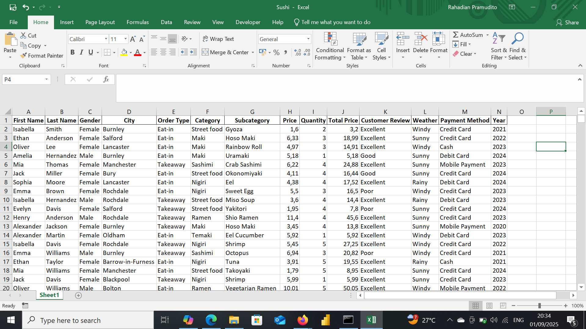
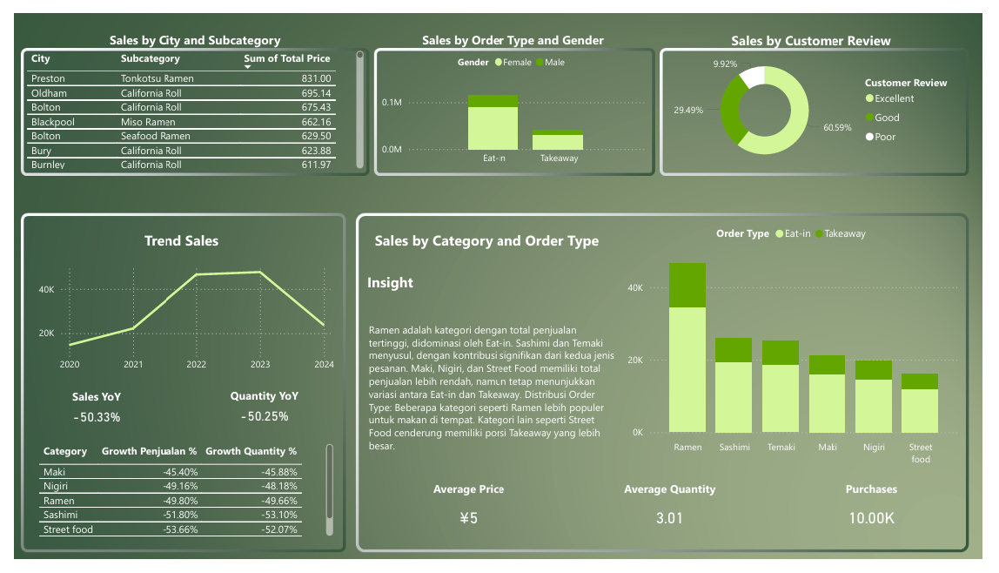

# Sushi Restaurant Sales

## Project Overview

**Project Title**: Superstore Sales Analysis  
**Database**: `Sushi`

This project is designed to demonstrate analysis Python, Power BI and techniques typically used by data analysts to explore, clean, and analyze superstore sales data. The project involves import database from csv file and performing exploratory data analysis (EDA).

## Objectives

1. **Import retail sales database**: Import Sushi Restaurant sales database from csv.
2. **Data Cleaning**: Identify and remove any records with missing or null values.
3. **Standardizing Data**: Identify and standardize any records to give a better visualization.
4. **Exploratory Data Analysis (EDA)**: Perform basic exploratory data analysis to understand the dataset.
5. **Business Analysis**: Use Power BI to answer specific business questions and derive insights from the sales data.

## Project Structure

### 1. Database Setup

- **Database Creation**: The project starts by import a database from `sushi_restaurant.csv`.

  


### 2. Data Cleaning

- **Import database**: Import database to do a data transformations, cleaning etc..
- **Remove Duplicate**: Remove any duplicate record.
- **Standardize Data**: Ensure the data ready for analysis.
- **Null Value Check**: Check for any null values in the dataset and delete records with missing data.
- **Remove Columns**: Remove column that unused. 

```jupyterlab

import pandas as pd
import matplotlib.pyplot as plt
import seaborn as sns

df = pd.read_csv(r"C:\Users\user\OneDrive\Documents\Dataset\New Portfolio\Tasty Sushi\sushi_restaurant.csv")
df
```

### 3. Standardizing Data

```jupyter lab
df['Order Date'] = pd.to_datetime(df['Order Date'], format='mixed').dt.strftime('%d/%m/%Y')

df['Year'] = df['Order Date'].dt.year
```

### 4. Exploratory Data Analysis
```jupyter lab
df.info()

df.describe

df.head()

df.isnull().sum()

df.shape

df.duplicated().sum()

df['Category'].value_counts()

df['Payment Method'].value_counts()

sns.barplot(data = df, x= 'Category', y = 'Total Price')

sns.lineplot(data = df, x = 'Year', y = 'Total Price')

df.to_excel('Sushi.xlsx', index=False)
```

### 5. Remove Columns
```jupyter lab
df.drop(columns = ['Order ID', 'Order Date', 'Order Time'], inplace=True)
```

### 6. Data Analysis & Findings


  

## Findings

1. Top-Selling Categories
- Ramen is the highest-selling category, especially through Eat In orders.
- Followed by Sashimi and Temaki as strong performers.
- Street Food has the lowest sales, particularly in Takeaway orders.
  
2. Category Growth
- Ramen shows the highest growth rate at 50.3%, indicating rising consumer interest.
- Categories like Nigiri and Street Food show low or negative growth, possibly due to lack of promotion or appeal.
  
3. Customer Reviews
- Most customers gave 5-star ratings (52.6%), with an average rating of 4.2, suggesting high satisfaction.
- Ramen has the highest average rating, while Street Food ranks lowest (3.0).
  
4. Yearly Sales Trends
- Sales in 2022 increased by 50.7%, while 2021 saw a drop of 50.3%—possibly reflecting post-pandemic recovery or improved business strategy.
  
5. Sales Distribution by City
- Cities like Preston, Manchester, and Leeds dominate ramen sales.
- California Roll is popular in Bolton, Bury, and Burnley, showing regional preferences.
  
6. Order Type and Gender
- Eat In orders outperform Takeaway, especially among female customers.
- This could inform strategies for dine-in promotions or space optimization.


## Strategic Reccomendations
- Focus on expanding Ramen and Sashimi categories, especially for dine-in experiences.
- Reevaluate the Street Food strategy—consider improving quality, pricing, or marketing.
- Leverage high-performing cities for loyalty programs or expansion.
- Use review data to maintain quality and uplift lower-rated categories.

My social media:

- **Instagram**: [Let's Connect](https://www.instagram.com/inirtp?igsh=MW9xZTU0bTRuaHlxeQ==)
- **LinkedIn**: [Connect with me professionally](https://www.linkedin.com/in/rahadian-triaji-pramudito-a43949273/)

I look forward to connecting with you!
