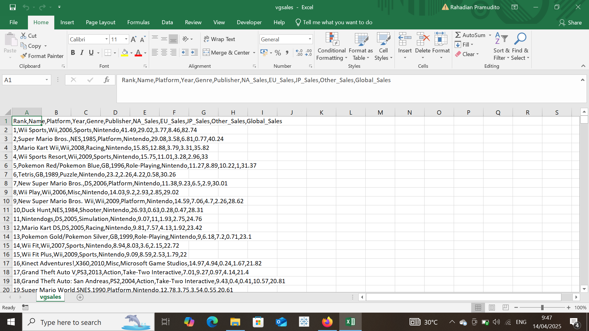
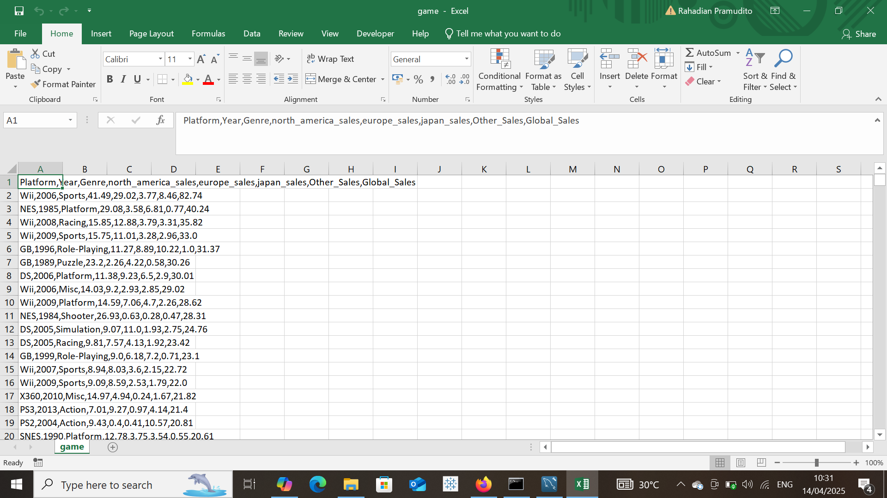
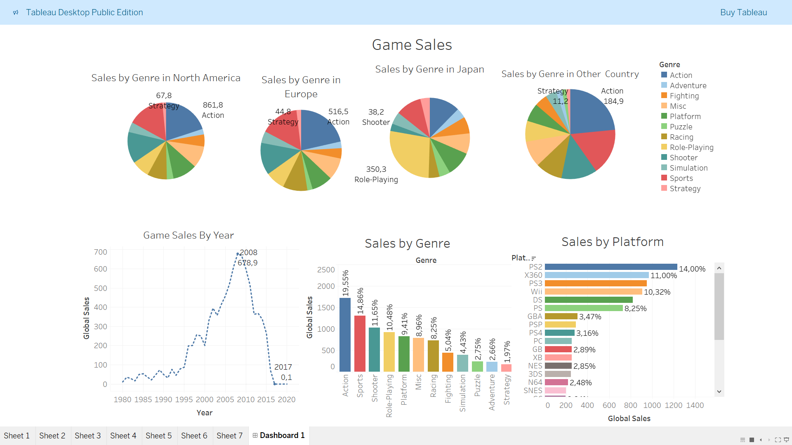

# Video Game Sales Mini Project

## Project Overview

**Project Title**: Video Game Sales Analysis  

This project is designed to demonstrate SQL skills and techniques typically used by data analysts to explore, clean, and analyze video game sales data. The project involves import database from csv file, performing cleaning data, and answering specific business questions using Python, SQL, and Tableau.

## Objectives

1. **Dataset From Kaggle**: Download video game sales dataset from kaggle.
2. **Correlation Analysis**: Because we gonna sales trend in many years and accross some country. We need to check column that has strong correlation with main columns which is Global Sales.
3. **Data Cleaning**: Identify and remove any records with missing or null values and drop any column that has weak correlation with Global Sales and are not relevant to the business question.
5. **Exploratory Data Analysis (EDA)**: Perform basic exploratory data analysis to understand the dataset.
6. **Business Analysis**: Use SQL to answer specific business questions and derive insights from the sales data.

## Project Structure

### 1. Database Setup

- **Database Creation**: The project starts by import a database from `vgsales.csv`.

  


### 2. Data Cleaning

- **Import database**: Importing dataset using pandas.
- **Correlation Analysis**: Because we gonna sales trend in many years and accross some country. We need to check column that has strong correlation with main columns which is Global Sales.
- **Remove Columns**: Remove column that have a correlation value of 0 to global sales. but still consider according to analysis needs
- **Null Value Check**: Check for any null values in the dataset and delete records with missing data.
 

```python
import pandas as pd

# Load dataset
data = pd.read_excel("sales.xlsx")

# One-hot encoding for categorical columns
data = pd.get_dummies(data, columns=["Platform", "Genre", "Publisher"], drop_first=True)

# Calculate the correlation matrix
correlation = data.corr()

# Take correlation only against target column (Global_Sales)
correlation_with_sales = correlation["Global_Sales"].sort_values(ascending=False)

# Show results
print("Korelasi dengan Global_Sales:")
print(correlation_with_sales)

Korelasi dengan Global_Sales:
Global_Sales                    1.000000
north_america_sales             0.941269
europe_sales                    0.903264
Other_Sales                     0.747964
japan_sales                     0.612774
                                  ...   
Publisher_Namco Bandai Games   -0.041960
Platform_PC                    -0.042483
Platform_PSP                   -0.053402
Genre_Adventure                -0.066303
Year                           -0.074647
Name: Global_Sales, Length: 622, dtype: float64

columns_to_drop = ['Rank','Name', 'Publisher']
df.drop(columns_to_drop, axis=1, inplace=True)

# NOTE : I maintain the platform, genre and year columns taking into account the purpose of the analysis.
```
```Python
#Standardize Data
df = df.rename(columns = {'NA_Sales' : 'north_america_sales', 'EU_Sales' : 'europe_sales', 'JP_Sales' : 'japan_sales'})

#Check Null Values and drop it
df.isnull().any()

Platform               False
Year                    True
Genre                  False
north_america_sales    False
europe_sales           False
japan_sales            False
Other_Sales            False
Global_Sales           False
dtype: bool

df = df.dropna()
df.isnull().any()

Platform               False
Year                   False
Genre                  False
north_america_sales    False
europe_sales           False
japan_sales            False
Other_Sales            False
Global_Sales           False
dtype: bool

# Than export file
df.to_csv('game.csv', index=False)
```

### 3. Data Analysis & Findings

From here we use the file that was cleaned earlier. 
  

The following SQL queries were developed to answer questions:

1. **Analysis of total global sales per year.**:
```sql
SELECT 
	Year, 
	ROUND(SUM(Global_Sales),2) as total_sales
FROM game
GROUP BY Year
ORDER BY total_sales DESC;
```

2. **Platform Popularity Analysis**:
```sql 
SELECT 
	Platform, 
    ROUND(SUM(Global_Sales),2) as total_sales
FROM game
GROUP BY Platform
ORDER BY total_sales DESC;
```

3. **Analysis of the Most Profitable Genres**:
```sql
SELECT 
	Genre, 
    ROUND(SUM(Global_Sales),2) as total_sales
FROM game
GROUP BY Genre
ORDER BY total_sales DESC;
```

4. **Analysis of the Most Profitable Genres in Some Countries**:
```sql
SELECT 
	Genre, 
    ROUND(SUM(north_america_sales),2) as north_america_region,
    ROUND(SUM(europe_sales),2) as europe_region,
    ROUND(SUM(japan_sales),2) as japan_region,
    ROUND(SUM(Other_Sales),2) as other_region,
    ROUND(SUM(Global_Sales),2) as total_sales
FROM game
GROUP BY Genre
ORDER BY total_sales DESC;SELECT 
    EXTRACT(MONTH FROM sale_date) as month,
    AVG(amount) as avg_sale
FROM cho_sales2
GROUP BY month
ORDER BY avg_sale DESC
LIMIT 1;
```

## Findings

- **Sales Trends**: Yearly analysis shows variations in sales, helping identify peak seasons.
- **Popular Genre**: The analysis identifies the most profitable Genre.
- **Platform Popularity**: Determine which platforms contribute the most to global sales.
- **Most Profitable Genres in Several Regions**: Analysis of the most successful platforms and genres in several regions.

## Reports

- **Sales Summary**: A detailed report summarizing total sales several years, Genre and Platform popularity, biggest markets.
- **Trend Analysis**: Insights into sales trends in several years and regions.
- **Product Insights**: Reports on top selling games.

## Visualization 
**Using Tableau**


My social media:

- **Instagram**: [Let's Connect](https://www.instagram.com/inirtp?igsh=MW9xZTU0bTRuaHlxeQ==)
- **LinkedIn**: [Connect with me professionally](https://www.linkedin.com/in/rahadian-triaji-pramudito-a43949273/)

I look forward to connecting with you!
