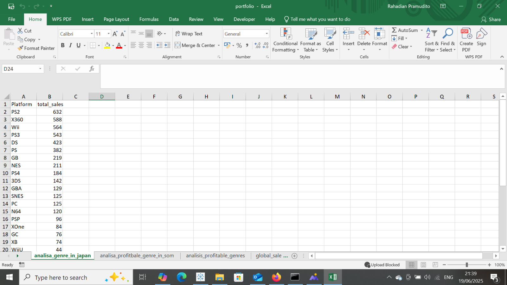
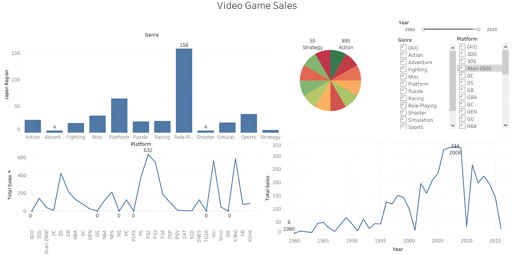

# Game Industry Sales Intelligence Report

## Overview
Analisis berbasis data terhadap industri game global, dimulai dari dataset publik Kaggle hingga visualisasi dashboard Tableau yang menyoroti tren genre, platform dominan, dan wilayah dengan potensi terbesar.

**Alur Proyek:**
Kaggle Dataset → Python (Data Cleaning) → SQL (Analytical Queries) → Tableau (Interactive Dashboard)

## 1. Data Acquisition & Cleaning (Python)
- Dataset diunduh dari Kaggle: 
- Data dibersihkan dengan mempertimbangkan:
- Menghapus nilai null pada kolom Year, Global_Sales, dan Genre
- Menstandarisasi format kolom (uppercase, titlecase)
- Mengubah kolom Year menjadi numeric (integer) untuk visualisasi kronologis
- Simpan data bersih ke file .csv untuk digunakan di SQL dan Tableau
  
**File Notebook: Portofolio Game Sales.ipynb**

**Output CSV: vgsales.csv**

   
  
## 2. Analytical Case Studies (SQL)
Dilakukan analisis untuk lima studi kasus utama:
| Studi Kasus | Deskripsi | 

| A. Global Sales Timeline | Tren penjualan game dari tahun ke tahun | 

| B. Genre Dominance Map | Genre paling menguntungkan secara global | 

| C. Regional Performance | Genre terkuat per wilayah (NA (North America), EU (Europe), JP (Japan), Other) | 

| D. Platform Power Play | Platform dengan penjualan tertinggi sepanjang sejarah | 

| E. Publisher Footprint | Kontribusi publisher terhadap keberagaman genre dan region | 

**Query SQL: portofolio.sql**
**Output per kasus: disimpan sebagai .csv dan digunakan di Tableau**

## 3. Visualization Dashboard (Tableau)##

- Visualisasi interaktif mencakup:
- Line chart untuk tren penjualan global
- Bar chart genre terpopuler secara global dan per region
- Stacked bar platform atau wilayah penjualan utama
- Insight bisnis dikemas secara naratif layaknya executive briefing
- Semua visual disusun untuk mendukung simulasi pitch ke publisher game
- 
**Preview Visualisasi:**
 

## 4. Executive Summary & Recommendations##

Genre Action dan Sports mendominasi secara global. Namun, genre Role-Playing menunjukkan kekuatan luar biasa di Jepang. Berdasarkan tren historis dan potensi wilayah, kami merekomendasikan fokus pengembangan judul lintas-genre dengan multiplatform release di Switch dan PS4 untuk pasar Jepang dan Eropa.

**Tech Stack**
- Python (Pandas)
- MySQL 
- Tableau Public

🙋‍♂️ About Me

Saya Rahadian — peminat logika deduktif, storytelling visual, dan analisis berbasis data. Saya menikmati membangun insight dari potongan puzzle data yang tersebar—baik sebagai analis, detektif, atau arsitek visualisasi. Silakan lihat repositori lain saya untuk logika puzzle, SQL challenges, dan proyek visualisasi data lainnya.

Linkedin : 

www.linkedin.com/in/rahadian-triaji-pramudito
